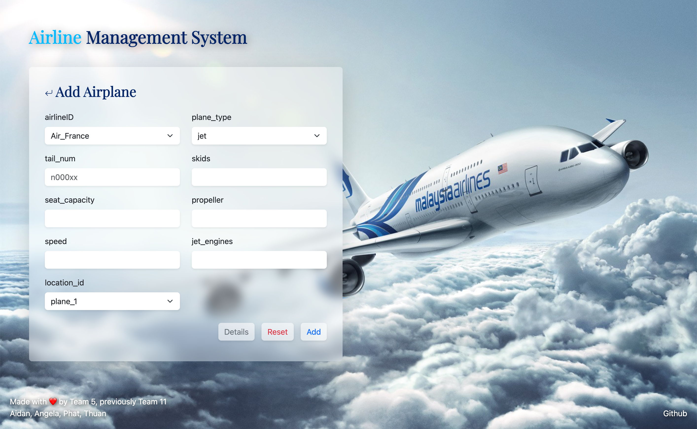

# Airline Management System

- CS 4400, Phase 4, Spring 2023

### Prerequisites

- MySQL Server
- MySQL Workbench
- Python 3+

### Installing

Install these python libraries:

    pip install flask flask-mysql

## Running the tests

0. Run default database script

1. Run MySQL scripts (stored procedures and database schema) in SQL folder

OR RUN `refill_db.sh` for step 0 & 1

2. Set approriate MySQL server username & password in db_credentials.txt
    - 1st line is username
    - 2nd line is password

3. Go into flask app folder, and run:

        python app.py

4. Go to the link below or the link shown in terminal:

    [127.0.0.1:8080](http://127.0.0.1:8080/main)

## Built With

  - HTML, CSS, JS, Bootstrap
  - Flask, Python

## Demo
Main Page

Add Page

Simulation and Table Browser

## Authors
  
  - Aidan Stickan (astickan3@gatech.edu) (Back end, SQL stored procedure to Python script design) 
  - Angela Zheng (azheng72@gatech.edu) (Back end, SQL views to Python script design)
  - Phat Bui (pbui30@gatech.edu) (Back end, user input error handling)
  - Thuan Vo (hvo41@gatech.edu) (Front end, GUI design)

## Credits

  - Background image by Malaysia Airways
  - Flight Simulator image by @MSFSofficial
